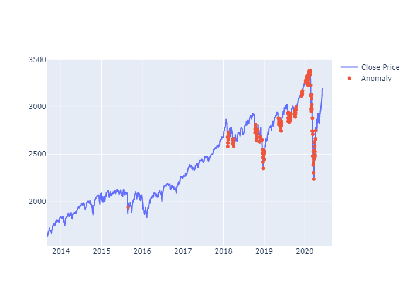

# Anomaly_Detection_S&P_500

The S&P 500 is a stock performance indicator for the Top 500 Companies listed on the stock exchange in the United States. It is considered as one of the best representations of the United States stock market. I have performed a Time Series Analysis on S&P 500 historical data to detect sudden price change. To achieve the mentioned task, an LSTM Autoencoder was built, the architecture of the model and related metrics can be viewed in the [Jupyter Notebook](./Notebook.ipynb). The dataset was acquired from [Yahoo Finance](https://query1.finance.yahoo.com/v7/finance/download/%5EGSPC?period1=504921600&period2=1591574400&interval=1d&events=history). The plot below displays various sudden price changes detected by the developed model. 

  

